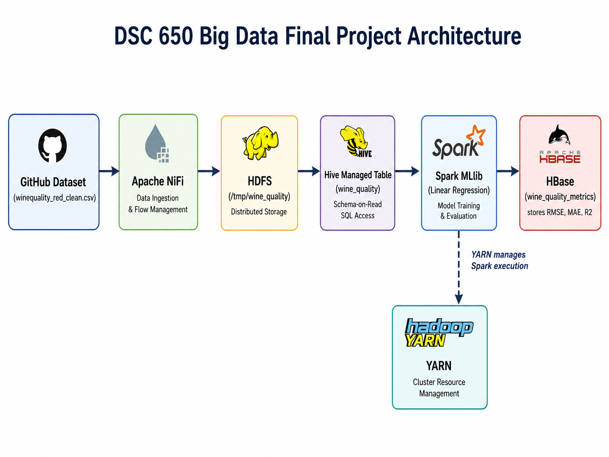

# DSC 650 Big Data Final Project

## Red Wine Quality Prediction Pipeline

This repository contains my final project for **DSC 650 – Big Data** at Bellevue University.

The project implements an end-to-end big data pipeline using **Apache NiFi, HDFS, Hive, Spark MLlib, YARN, HBase, and Python**. The pipeline ingests a GitHub-hosted wine quality dataset, stores it in HDFS, structures it with Hive, trains a machine-learning model using Spark MLlib, submits the Spark application through YARN, and stores model-performance metrics in HBase.

---

## Project Architecture



The completed pipeline follows this architecture:

```text
GitHub Dataset
      ↓
Apache NiFi
      ↓
HDFS
      ↓
Hive Managed Table
      ↓
Spark MLlib
      ↓
HBase

YARN manages Spark execution.
```

---

## Dataset

The project uses a cleaned version of the **Red Wine Quality dataset**.

The dataset contains **1,599 wine samples** with 11 chemical characteristics and one numeric quality score.

### Predictor Variables

* `fixed_acidity`
* `volatile_acidity`
* `citric_acid`
* `residual_sugar`
* `chlorides`
* `free_sulfur_dioxide`
* `total_sulfur_dioxide`
* `density`
* `ph`
* `sulphates`
* `alcohol`

### Target Variable

* `quality`

The dataset used by the pipeline is stored in this repository at:

```text
data/winequality_red_clean.csv
```

Direct GitHub raw URL:

```text
https://raw.githubusercontent.com/pancaketoes/dsc650-wine-quality-pipeline/main/data/winequality_red_clean.csv
```

---

## Technologies Used

| Technology   | Purpose                                                       |
| ------------ | ------------------------------------------------------------- |
| Apache NiFi  | Dataset ingestion and flow orchestration                      |
| HDFS         | Distributed storage                                           |
| Apache Hive  | Managed table creation and SQL queries                        |
| Apache Spark | Distributed data processing                                   |
| Spark MLlib  | Machine-learning model training and evaluation                |
| YARN         | Spark workload and cluster resource management                |
| Apache HBase | Storage of model-performance metrics                          |
| HappyBase    | Python interface to HBase through the Thrift server           |
| Python       | Spark ML application and HBase integration                    |
| GitHub       | Dataset hosting, source control, and final project submission |

---

## Objective 1 – NiFi Data Ingestion into HDFS

Apache NiFi was used to download the CSV dataset directly from GitHub and write it into HDFS.

The NiFi flow used the following processors:

```text
InvokeHTTP
    ↓
UpdateAttribute
    ↓
PutHDFS
```

The dataset was written to:

```text
/tmp/wine_quality
```

Successful ingestion was verified using:

```bash
hdfs dfs -ls /tmp/wine_quality
```

The HDFS listing confirmed the presence of:

```text
/tmp/wine_quality/winequality_red_clean.csv
```

NiFi source files and screenshots are available in the [`nifi`](nifi/) directory.

---

## Objective 2 – Hive Managed Table

A managed Hive table named:

```text
wine_quality
```

was created using the schema defined in:

```text
hive/create_tables.sql
```

The CSV file stored in HDFS was loaded into the Hive table using:

```sql
LOAD DATA INPATH '/tmp/wine_quality/winequality_red_clean.csv'
INTO TABLE wine_quality;
```

The data was verified with sample queries and an aggregation query:

```sql
SELECT quality, COUNT(*) AS wine_count
FROM wine_quality
GROUP BY quality
ORDER BY quality;
```

The aggregation confirmed that the dataset was correctly loaded and parsed.

Hive SQL, documentation, and screenshots are available in the [`hive`](hive/) directory.

---

## Objective 3 – Environment Setup

The Python libraries required for the Spark and HBase integration were installed on the master and worker nodes.

Primary packages included:

```text
numpy
happybase
```

The HBase Thrift server was also started and verified before executing the Spark application.

HappyBase uses the Thrift server to allow the Python application to communicate with HBase.

Environment documentation and screenshots are available in the [`docs`](docs/) directory.

---

## Objective 4 – HBase Table Creation

An HBase table was created for storing machine-learning performance metrics:

```text
wine_quality_metrics
```

The table uses the column family:

```text
metrics
```

The table was initially scanned before the Spark application ran and returned zero rows.

The HBase commands and screenshots are available in the [`hbase`](hbase/) directory.

---

## Objective 5 – Spark MLlib Machine Learning

Spark reads the dataset directly from the Hive managed table:

```text
default.wine_quality
```

The 11 chemical predictor variables are combined using Spark MLlib's `VectorAssembler`.

The dataset is divided into:

```text
80% training data
20% testing data
```

with a reproducible random seed of `42`.

### Machine Learning Algorithm

The project uses:

```text
Linear Regression
```

Linear Regression was selected because the target variable, `quality`, is numeric.

The model predicts wine quality using the chemical characteristics of each wine sample.

---

## Model Evaluation

The final Spark MLlib model produced the following results:

```text
RMSE: 0.6846
MAE:  0.5375
R2:   0.4154
```

### Interpretation

* **RMSE = 0.6846**
  Prediction errors were approximately 0.68 wine-quality points when larger errors were given greater weight.

* **MAE = 0.5375**
  The average absolute prediction error was approximately 0.54 quality points.

* **R2 = 0.4154**
  The model explained approximately 41.5% of the variation in wine quality within the testing dataset.

The PySpark source code, Spark documentation, and evaluation screenshots are available in the [`spark`](spark/) directory.

---

## Objective 6 – Spark Submit and YARN

The PySpark ML application was submitted through YARN using:

```bash
spark-submit --master yarn /root/analysis.py
```

YARN managed the Spark workload while the application:

1. Read data from Hive.
2. Prepared the feature vectors.
3. Trained the Linear Regression model.
4. Generated predictions.
5. Calculated model-performance metrics.
6. Wrote the metrics into HBase.

Successful execution was verified through the Spark and YARN output logs.

---

## Objective 7 – HBase Metrics Verification

After Spark completed, the `wine_quality_metrics` HBase table was scanned again.

Spark wrote a row using the row key:

```text
linear_regression
```

The following columns were stored:

```text
metrics:rmse
metrics:mae
metrics:r2
metrics:model
metrics:timestamp
```

The populated HBase scan confirmed that the machine-learning metrics were successfully written and that the full pipeline operated end-to-end.

---

## Repository Structure

```text
dsc650-wine-quality-pipeline/
│
├── README.md
│
├── data/
│   └── winequality_red_clean.csv
│
├── architecture/
│   └── architecture-diagram.png
│
├── nifi/
│   ├── README.md
│   ├── flow-definition.json
│   └── screenshots/
│       ├── nifi-flow.png
│       ├── nifi-running.png
│       └── hdfs-ingestion-verification.png
│
├── hive/
│   ├── README.md
│   ├── create_tables.sql
│   ├── queries.sql
│   └── screenshots/
│       ├── hive-load-results.png
│       └── hive-query-results.png
│
├── spark/
│   ├── README.md
│   ├── analysis.py
│   └── screenshots/
│       ├── spark-training-output.png
│       ├── spark-ml-evaluation.png
│       └── spark-submit-output.png
│
├── hbase/
│   ├── README.md
│   ├── commands.txt
│   └── screenshots/
│       ├── hbase-empty-scan.png
│       └── hbase-populated-scan.png
│
└── docs/
    ├── project-summary.md
    └── screenshots/
        ├── package-installation.png
        └── hbase-thrift-server.png
```

---

## Challenges Encountered

Several issues were encountered while implementing the pipeline.

The Docker environment used generated container names rather than simple names such as `master` or `namenode`, so `docker ps` was used to identify the correct master and worker containers.

The HBase Thrift server also required verification before Spark execution. An initial HappyBase connection attempt returned a connection-refused error on port `9090`. Restarting and verifying the Thrift server resolved the issue.

NiFi processor execution also had to be controlled carefully to prevent duplicate copies of the CSV file from entering the pipeline.

These issues reinforced the importance of validating each component individually before continuing to the next stage of an integrated big data workflow.

---

## Project Result

The project successfully demonstrated the complete flow:

```text
GitHub
   ↓
NiFi
   ↓
HDFS
   ↓
Hive
   ↓
Spark MLlib
   ↓
YARN-managed execution
   ↓
HBase
```

The final HBase scan confirmed that Spark's machine-learning evaluation metrics were successfully persisted, completing the end-to-end pipeline.

For additional implementation details, challenges, results, and production considerations, see:

[`docs/project-summary.md`](docs/project-summary.md)
